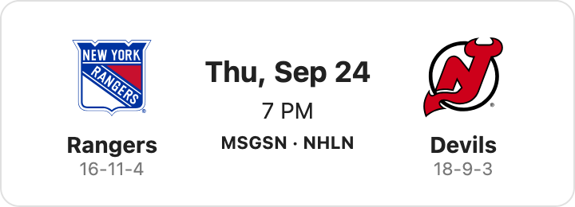
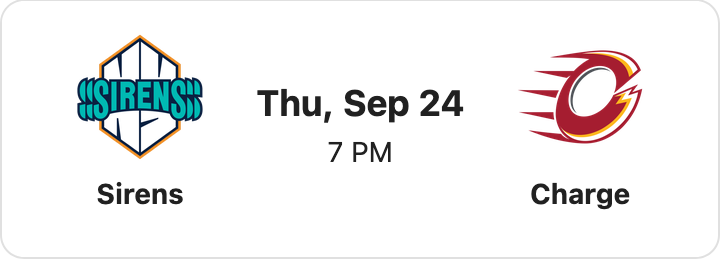
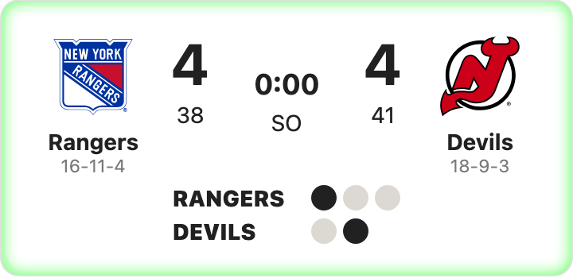
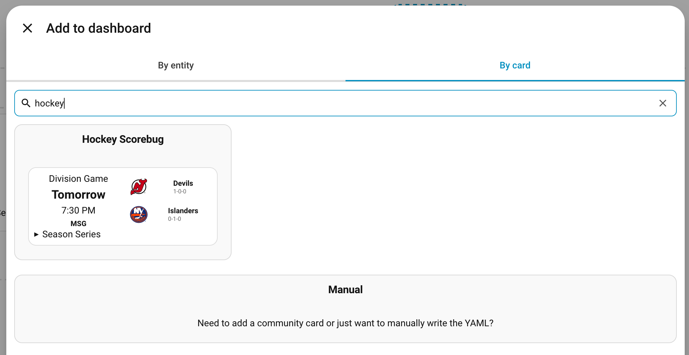
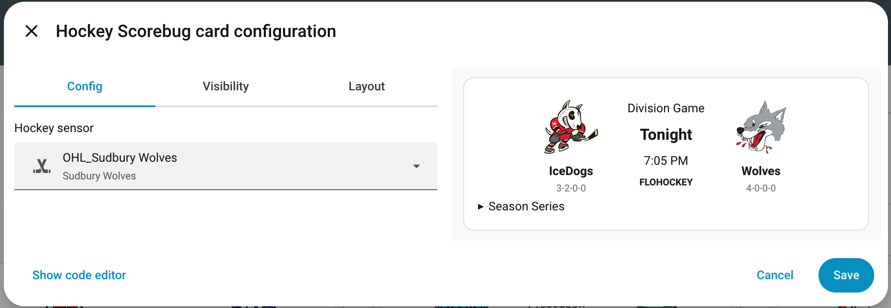

# Hockey Scorebug Card

A companion Lovelace card for displaying live and upcoming hockey game scorebugs.

**This card requires https://github.com/tryonegg/ha-hockey also be installed.**

## Screenshots







## Installation

### HACS

1. Open HACS in Home Assistant.
2. Click the ⋮ menu in the top right and choose **Custom repositories**.
3. Enter this repository URL:
   `https://github.com/tryonegg/ha-hockey-card`
4. Set the type to **Dashboard** and click **Add**.
5. Find "Hockey Scorebug Card" in HACS and click **Download**.
6. Reload your browser (or restart Home Assistant if the card doesn't appear).

### Manual installation

After running the build, copy the generated file from the `dist` folder into your Home Assistant `www` directory and reference it in your dashboard:

- `dist/hockey-scorebug-card.js`

This is a single-file card bundle, so no separate CSS file is required when installed from the built output.

## Usage

1. Add the companion component https://github.com/tryonegg/ha-hockey
1. Add a team with that component
1. Add a new card to a dashboard. Select By Card. Search for Hockey, Select the card 
1. Pick your tracked team. Select save  

## Development

To bundle the stylesheet into the JavaScript for a single-file HACS install:

```bash
npm run build
```

This reads the source files from `src/` and writes the bundled output to `dist/hockey-scorebug-card.js`.
